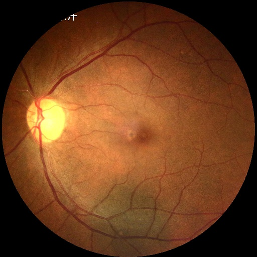

# CataractDetection
This project is about identifying cataracts from fundus images of the eye

## Table of Contents
- [Description](#-description)
- [App Creation Process](#-app-creation-process)
- [How to access](#-how-to-access)
- [Future endeavors](#-future-endeavors)
- [Feedback](#-feedback)
- [Contact Us](#-contact-us)

## Description

This app is a **cataract detection** software meant to identify cataracts based on fundus images uploaded to the app. The purpose of the app is reduce the workload of ophthalmologists, who currently must hand-label fundus images of eye lens as "Cataract" or "Normal." This app will greatly aid rural areas, where there is often only **1** ophthalmologist per **100,000** patients! This app would allow ophthalmologists, or patients themselves, to use an **ophthalmoscope**, which is attachable to a phone camera, to take a picture of patients' eyes. These pictures would then be uploaded to the app, which will return a diagnosis as well as the probability of the accuracy of the diagnosis.

## App Creation Process

1. The dataset was downloaded from [Kaggle](https://www.kaggle.com/datasets/andrewmvd/ocular-disease-recognition-odir5k), which is a website that offers free online datasets. The dataset contains fundus images that depict eyes that are affected by a disease and images that depict eyes not affected by a disease. There were five diseases including cataracts within the dataset 
2. Using google collab, the dataset was filtered to only include cataract images and normal images through pandas. Following this, the number of normal images was reduced in order to make the number of cataract images equal to the number of normal images to ensure that the model would not be biased towards any diagnosis.
3. Following this filtering, the dataset was split into train, validation, and test as an 80-10-10 split. Using the random class, images were randomly assigned into the train, validation, and test dataset in an 80-10-10 ratio.
4. The images in all 3 divisions were then featurized through the ConvNext Model, which is a featurization model that runs on the Mobilenet V-2 Architecture. After the images were featurized, the features were placed into an array in order to allow the model to take in the features.
5. Three ML models (KNN, RandomForrest, and MLP) were trained on the train dataset and validated on the validation dataset. Since they all yielded the same accuracy (96.5%) in detecting cataracts, I chose the MLP model since both KNN and RandomForrest have flaws that MLP does not.
6. Using the streamlit package, I programmed my web page on google collab and then imported it to Github and hosted it on the streamlit website, leading to the creation of my app.

(Put in a graphic later)

## How to Access

## Future Endeavors

## Feedback

## Contact Us

